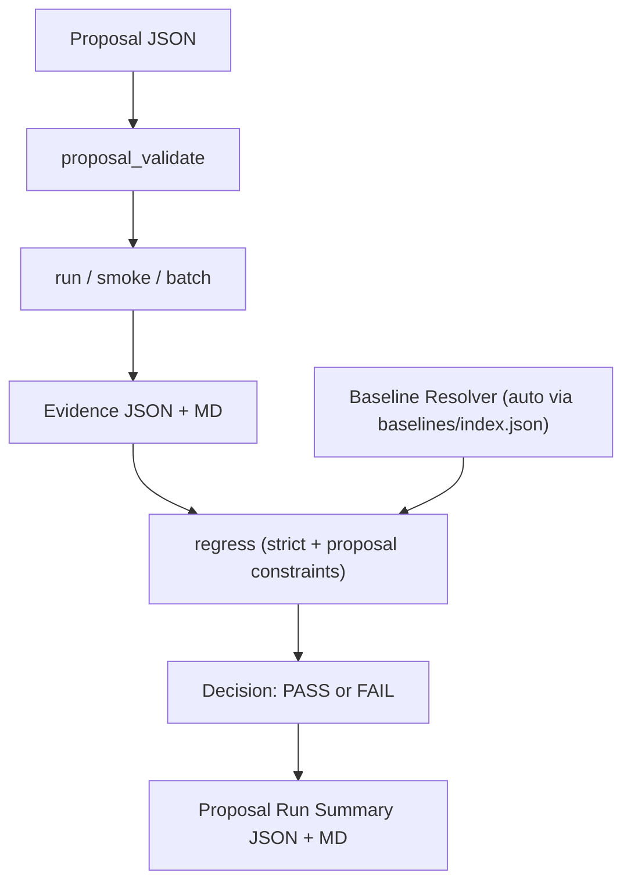

# GateForge (minimal skeleton)

Minimal `run -> evidence -> gate` pipeline for learning and bootstrapping CI/regression governance.

Demo entry points: see `DEMO.md`.

## I. Overview

### 1. Goals

- Provide a reproducible evidence pipeline for simulation-related changes.
- Make gate decisions explainable via structured outputs (`json + md`).
- Keep backend execution replaceable (OpenModelica now, FMU runner later).

### 2. End-to-End Flow



### 3. Why Not Just Model Check?

`Model Check` answers: "does this model compile/check right now?"

GateForge answers additional governance questions needed in CI and long-lived projects:
- Is candidate worse than baseline (regression)?
- Is the comparison valid (same backend/model_script/schema)?
- What failed, exactly (structured failure reason)?
- Where is the evidence (json + markdown artifacts)?

### 4. Current Gate Criteria (v0)

A regression decision is `FAIL` if any of these is true:
- Candidate `status` is not `success`
- Candidate `gate` is not `PASS`
- Baseline had `check_ok=true` but candidate has `check_ok=false` (`check_regression`)
- Baseline had `simulate_ok=true` but candidate has `simulate_ok=false` (`simulate_regression`)
- Runtime exceeds allowed threshold (`runtime_regression`)
- In strict mode: schema/backend/model_script mismatch
- In proposal-constrained mode: baseline/candidate must match proposal backend/model_script

Policy overlay (`policies/default_policy.json`):
- Critical reasons -> `FAIL`
- Runtime-only regression -> `NEEDS_REVIEW` for `low/medium`, `FAIL` for `high`

### 5. Non-goals (current stage)

- Building a modeling copilot/agent.
- Supporting every simulation tool/backend.
- Building UI/dashboard or SaaS infrastructure.

## II. Setup

### 1. Prerequisites

- Python 3.10+
- Docker Desktop installed and running
- OpenModelica Docker image:

```bash
docker pull openmodelica/openmodelica:v1.26.1-minimal
```

### 2. Install and run locally (mock backend)

```bash
python -m venv .venv
source .venv/bin/activate
pip install -e .
python -m unittest discover -s tests -v
python -m gateforge.smoke --backend mock --out artifacts/evidence.json
cat artifacts/evidence.json
cat artifacts/evidence.md
```

## III. Workflow

### 1. Happy Path (quick start)

```bash
python -m gateforge.proposal_validate --in examples/proposals/proposal_v0.json
python -m gateforge.run \
  --proposal examples/proposals/proposal_v0.json \
  --baseline auto \
  --out artifacts/proposal_run.json
cat artifacts/proposal_run.json

# one-command demo (docker-independent)
bash scripts/demo_proposal_flow.sh

# checker threshold demo (docker-independent)
bash scripts/demo_checker_config.sh

# behavior drift demo (steady-state checker)
bash scripts/demo_steady_state_checker.sh

# behavior metrics demo (overshoot/settling/steady-state checker)
bash scripts/demo_behavior_metrics_checker.sh

# combined demo bundle (docker-independent)
bash scripts/demo_all.sh
# bundle summary now includes checker + steady-state + behavior-metrics signals

# local CI matrix simulation (workflow_dispatch-like toggles)
bash scripts/demo_ci_matrix.sh

# agent change safety loop demo (low-risk pass, high-risk needs review)
bash scripts/demo_agent_change_loop.sh

# planner confidence gates demo (PASS / NEEDS_REVIEW / FAIL)
bash scripts/demo_planner_confidence_gates.sh

# fail -> repair -> rerun loop demo
bash scripts/demo_repair_loop.sh

# human review resolution demo (NEEDS_REVIEW -> human approve/reject -> final PASS/FAIL)
bash scripts/demo_review_resolution.sh

# review ledger demo (append + summarize review history)
bash scripts/demo_review_ledger.sh

# review ledger export demo (filtered records for audit/reporting)
bash scripts/demo_review_ledger_export.sh

# review KPI demo (approval/fail rates, risk split, 7-day volume)
bash scripts/demo_review_kpis.sh

# same demos with strict policy profile
POLICY_PROFILE=industrial_strict_v0 bash scripts/demo_all.sh

# autopilot dry-run review template demo
bash scripts/demo_autopilot_dry_run.sh
```

The demo script uses `examples/proposals/proposal_demo_mock.json` and writes an aligned
temporary baseline to `artifacts/baseline_demo_mock.json`.

Expected output shape:

```json
{"proposal_id":"proposal-0001","status":"PASS"}
```

```json
{
  "proposal_id": "proposal-0001",
  "actions": ["check", "simulate", "regress"],
  "status": "PASS",
  "smoke_executed": true,
  "regress_executed": true,
  "candidate_path": "artifacts/candidate_from_proposal.json",
  "baseline_path": "baselines/openmodelica_minimal_probe_baseline.json",
  "regression_path": "artifacts/regression_from_proposal.json",
  "fail_reasons": []
}
```

When gate fails, `status` becomes `FAIL` and `fail_reasons` is non-empty.
When policy returns `NEEDS_REVIEW`, the run summary includes `required_human_checks`.

### 2. Proposal schema v0 + validator

Validate a proposal before execution/gate:

```bash
python -m gateforge.proposal_validate --in examples/proposals/proposal_v0.json
```

Optional machine-readable validation result file:

```bash
python -m gateforge.proposal_validate \
  --in examples/proposals/proposal_v0.json \
  --out artifacts/proposal_validate.json
cat artifacts/proposal_validate.json
```

Current proposal schema file:

- `schemas/proposal.schema.json`
- Optional `checkers` field in proposal:
  - `["timeout", "nan_inf", "performance_regression", "event_explosion", "steady_state_regression", "control_behavior_regression"]`
  - If omitted, all built-in checkers run by default
- Optional `checker_config` field in proposal:
  - `{"performance_regression": {"max_ratio": 1.5}}`
  - `{"event_explosion": {"max_ratio": 1.8, "abs_threshold_if_baseline_zero": 50}}`
  - `{"steady_state_regression": {"max_abs_delta": 0.05}}`
  - `{"control_behavior_regression": {"max_overshoot_abs_delta": 0.1, "max_settling_time_ratio": 1.5, "max_steady_state_abs_delta": 0.05}}`
  - `{"_runtime": {"enable": ["steady_state_regression"], "disable": ["performance_regression"]}}`

Drive smoke execution from proposal:

```bash
python -m gateforge.smoke --proposal examples/proposals/proposal_v0.json --out artifacts/evidence_from_proposal.json
cat artifacts/evidence_from_proposal.json
```

Generate an agent-authored proposal (Agent v0, rule-based):

```bash
python -m gateforge.agent --intent demo_mock_pass --out artifacts/agent_proposal.json
python -m gateforge.run --proposal artifacts/agent_proposal.json --baseline auto --out artifacts/agent_run.json
cat artifacts/agent_run.json
```

One-command agent execution (proposal -> run -> audit summary):

```bash
python -m gateforge.agent_run \
  --intent demo_mock_pass \
  --policy-profile industrial_strict_v0 \
  --baseline baselines/mock_minimal_probe_baseline.json \
  --emit-checker-template artifacts/agent/checker_template.json \
  --out artifacts/agent/agent_run.json
cat artifacts/agent/agent_run.json
```

Intent file mode (LLM/external planner friendly):

```bash
cat > /tmp/intent.json <<'EOF'
{
  "intent": "demo_mock_pass",
  "proposal_id": "agent-intent-file-001",
  "overrides": {
    "risk_level": "medium",
    "change_summary": "Planner-generated proposal"
  }
}
EOF

python -m gateforge.agent_run \
  --intent-file /tmp/intent.json \
  --baseline baselines/mock_minimal_probe_baseline.json \
  --out artifacts/agent/agent_run_from_intent_file.json
```

Deterministic model patch before run (change_set):

```bash
python -m gateforge.run \
  --proposal examples/proposals/proposal_with_changeset_mock.json \
  --baseline baselines/mock_minimal_probe_baseline.json \
  --out artifacts/proposal_run_changeset.json
cat artifacts/proposal_run_changeset.json
```

Failing patch demo (shows `change_apply_failed` and required human checks):

```bash
python -m gateforge.run \
  --proposal examples/proposals/proposal_with_changeset_mock_fail.json \
  --baseline baselines/mock_minimal_probe_baseline.json \
  --out artifacts/proposal_run_changeset_fail.json
cat artifacts/proposal_run_changeset_fail.json
cat artifacts/proposal_run_changeset_fail.md
```

Minimal planner mode (rule-based, LLM-ready interface):

```bash
python -m gateforge.llm_planner \
  --goal "run a low risk demo pass on mock backend" \
  --planner-backend rule \
  --proposal-id planner-demo-001 \
  --out artifacts/agent/intent_from_planner.json

python -m gateforge.agent_run \
  --intent-file artifacts/agent/intent_from_planner.json \
  --baseline baselines/mock_minimal_probe_baseline.json \
  --out artifacts/agent/agent_run_from_planner.json
```

Planner intent payload can include:
- `overrides` (e.g. `risk_level`, `checkers`, `checker_config`)
- `change_plan` (structured operation list; each op must include `reason` and `confidence` in `[0,1]`)
- `change_set_draft` (direct change-set JSON)

Schema reference:
- `schemas/intent.schema.json`

Planner can also emit a `change_set_draft`:

```bash
python -m gateforge.llm_planner \
  --goal "apply deterministic patch and run" \
  --planner-backend rule \
  --emit-change-set-draft \
  --out artifacts/agent/intent_with_change_set_draft.json
```

One-command autopilot (goal -> planner -> agent_run):

```bash
python -m gateforge.autopilot \
  --goal "run demo mock pass" \
  --planner-backend rule \
  --proposal-id autopilot-demo-001 \
  --policy-profile industrial_strict_v0 \
  --baseline baselines/mock_minimal_probe_baseline.json \
  --emit-checker-template \
  --save-run-under autopilot \
  --out artifacts/autopilot/autopilot_summary.json
cat artifacts/autopilot/autopilot_summary.json
cat artifacts/autopilot/autopilot_summary.md
```

Autopilot can materialize planner `change_set_draft` and inject `change_set_path`:

```bash
python -m gateforge.autopilot \
  --goal "apply deterministic patch and run" \
  --planner-backend rule \
  --materialize-change-set \
  --proposal-id autopilot-changeset-001 \
  --baseline baselines/mock_minimal_probe_baseline.json \
  --out artifacts/autopilot/autopilot_changeset_summary.json
```

Plan-only mode (no execution):

```bash
python -m gateforge.autopilot \
  --goal "run demo mock pass" \
  --proposal-id autopilot-plan-001 \
  --dry-run \
  --out artifacts/autopilot/autopilot_plan.json
cat artifacts/autopilot/autopilot_plan.json
```

In dry-run mode, summary also includes:
`planned_risk_level` and `planned_required_human_checks` (pre-execution human review template).
These checks are policy-driven via `dry_run_human_checks` in `policies/default_policy.json`.
Execution-time `required_human_checks` are also policy-driven via `required_human_checks` in the same file.

`autopilot_summary.json` includes governance-facing fields such as:
`policy_decision`, `policy_reasons`, `required_human_checks`, `fail_reasons`, `run_report_path`,
`change_apply_status`, `applied_changes_count`, `change_set_hash`, `policy_version`,
`planner_guardrail_decision`, and `planner_guardrail_violations`.

For planner-driven patches, policy can enforce confidence gates:
- below `min_confidence_auto_apply`: proposal becomes `NEEDS_REVIEW` (`change_plan_confidence_below_auto_apply`)
- below `min_confidence_accept`: proposal becomes `FAIL` (`change_plan_confidence_below_accept`)

Human review resolution (resolve `NEEDS_REVIEW` to final decision):

```bash
python -m gateforge.review_resolve \
  --summary artifacts/review_demo/source_needs_review.json \
  --review artifacts/review_demo/review_approve.json \
  --out artifacts/review_demo/final_approve.json
cat artifacts/review_demo/final_approve.json
```

Review decision schema reference:
- `schemas/review_decision.schema.json`

Repair loop (fail summary -> planner/autopilot repair -> rerun -> before/after delta):

```bash
python -m gateforge.repair_loop \
  --source artifacts/review_demo/source_needs_review.json \
  --planner-backend rule \
  --baseline baselines/mock_minimal_probe_baseline.json \
  --out artifacts/repair_loop/summary.json
cat artifacts/repair_loop/summary.json
cat artifacts/repair_loop/summary.md
```

Demo shortcut:

```bash
bash scripts/demo_repair_loop.sh
```

Repair batch (multiple fail summaries -> per-case repair loop -> aggregate summary):

```bash
python -m gateforge.repair_batch \
  --pack artifacts/repair_batch_demo/pack.json \
  --continue-on-fail \
  --summary-out artifacts/repair_batch_demo/summary.json \
  --report-out artifacts/repair_batch_demo/summary.md
cat artifacts/repair_batch_demo/summary.json
```

Demo shortcut:

```bash
bash scripts/demo_repair_batch.sh
```

Repair batch profile comparison (e.g., default vs industrial strict):

```bash
python -m gateforge.repair_batch \
  --pack artifacts/repair_batch_compare_demo/pack.json \
  --compare-policy-profiles default industrial_strict_v0 \
  --continue-on-fail \
  --summary-out artifacts/repair_batch_compare_demo/summary.json \
  --report-out artifacts/repair_batch_compare_demo/summary.md
cat artifacts/repair_batch_compare_demo/summary.json
```

Demo shortcut:

```bash
bash scripts/demo_repair_batch_compare.sh
```

Governance snapshot (single management view from repair compare + review KPI + ci matrix):

```bash
python -m gateforge.governance_report \
  --repair-batch-summary artifacts/repair_batch_compare_demo/summary.json \
  --review-ledger-summary artifacts/review_kpi_demo/kpi_summary.json \
  --ci-matrix-summary artifacts/ci_matrix_summary.json \
  --out artifacts/governance_snapshot_demo/summary.json \
  --report artifacts/governance_snapshot_demo/summary.md
cat artifacts/governance_snapshot_demo/summary.json
```

With trend compare against previous snapshot:

```bash
python -m gateforge.governance_report \
  --repair-batch-summary artifacts/repair_batch_compare_demo/summary.json \
  --review-ledger-summary artifacts/review_kpi_demo/kpi_summary.json \
  --ci-matrix-summary artifacts/ci_matrix_summary.json \
  --previous-summary artifacts/governance_snapshot_trend_demo/previous_summary.json \
  --out artifacts/governance_snapshot_trend_demo/summary.json \
  --report artifacts/governance_snapshot_trend_demo/summary.md
cat artifacts/governance_snapshot_trend_demo/summary.json
```

Demo shortcut:

```bash
bash scripts/demo_governance_snapshot.sh
```

Trend demo shortcut:

```bash
bash scripts/demo_governance_snapshot_trend.sh
```

Governance history (archive snapshots + summarize last N transitions):

```bash
python -m gateforge.governance_history \
  --history-dir artifacts/governance_history \
  --snapshot artifacts/governance_snapshot_demo/summary.json \
  --label daily_run \
  --last-n 7 \
  --out artifacts/governance_history/summary.json \
  --report artifacts/governance_history/summary.md
cat artifacts/governance_history/summary.json
```

History demo shortcut:

```bash
bash scripts/demo_governance_history.sh
```

Review ledger summary:

```bash
python -m gateforge.review_ledger \
  --ledger artifacts/review/ledger.jsonl \
  --sla-seconds 3600 \
  --top-unstable-n 5 \
  --min-unstable-non-pass-count 1 \
  --summary-out artifacts/review/ledger_summary.json \
  --report-out artifacts/review/ledger_summary.md
cat artifacts/review/ledger_summary.json
```

Review ledger filtered export:

```bash
python -m gateforge.review_ledger \
  --ledger artifacts/review/ledger.jsonl \
  --final-status FAIL \
  --since-utc 2026-02-13T00:00:00Z \
  --export-out artifacts/review/ledger_fail_records.json \
  --summary-out artifacts/review/ledger_fail_summary.json
cat artifacts/review/ledger_fail_records.json
```

Review KPI summary:

```bash
python -m gateforge.review_ledger \
  --ledger artifacts/review/ledger.jsonl \
  --summary-out artifacts/review/ledger_summary.json \
  --report-out artifacts/review/ledger_summary.md
cat artifacts/review/ledger_summary.json
```

KPI fields include:
- `kpis.approval_rate`
- `kpis.fail_rate`
- `kpis.by_risk_status_counts`
- `kpis.review_volume_last_7_days`
- `kpis.avg_resolution_seconds`
- `kpis.p95_resolution_seconds`
- `kpis.sla_breach_rate`
- `kpis.guardrail_fail_rate`
- `kpis.review_recovery_rate`
- `kpis.strict_non_pass_rate`
- `planner_guardrail_decision_counts`
- `planner_guardrail_rule_id_counts`
- `policy_profile_counts`

Planner variants:

```bash
# read goal from file
python -m gateforge.llm_planner \
  --goal-file /tmp/goal.txt \
  --planner-backend rule \
  --out artifacts/agent/intent_from_goal_file.json

# inject external context (for future LLM planners)
python -m gateforge.llm_planner \
  --goal "run pass flow" \
  --planner-backend rule \
  --context-json /tmp/planner_context.json \
  --out artifacts/agent/intent_from_context.json

# enforce planner guardrails for planner-emitted change_plan/change_set
python -m gateforge.llm_planner \
  --goal "apply deterministic patch and run" \
  --planner-backend rule \
  --emit-change-set-draft \
  --change-plan-confidence-min 0.8 \
  --change-plan-allowed-file examples/openmodelica/MinimalProbe.mo \
  --out artifacts/agent/intent_guarded.json
```

Planner backend option:
- `--planner-backend rule`: implemented (default)
- `--planner-backend openai`: placeholder only (validates `OPENAI_API_KEY`, then exits with not-implemented message)
- `--planner-backend gemini`: implemented (requires `GOOGLE_API_KEY`; default model `gemini-2.5-flash-lite`)

Planner guardrails (for LLM/rule outputs with `change_plan` / `change_set_draft`):
- `--change-plan-confidence-min` / `--change-plan-confidence-max`
- `--change-plan-allowed-root` / `--change-plan-allowed-suffix`
- `--change-plan-allowed-file` (exact whitelist)

Guardrail demo:

```bash
bash scripts/demo_planner_guardrails.sh
```

Autopilot forwards planner guardrails and writes them to evidence:
- `planner_guardrail_report_path`
- `planner_guardrail_decision` (`PASS` / `FAIL`)
- `planner_guardrail_violations` (non-empty when planner guardrail fails)
- `planner_guardrail_violation_objects` (structured `{rule_id,message}`)

Planner confidence guardrail defaults:
- if not explicitly set, `autopilot` uses policy `min_confidence_accept` as planner min confidence
- planner max confidence defaults to `1.0`

Repair loop fallback:
- when first attempt fails, repair loop retries once with conservative defaults
- fallback defaults: `planner-backend=rule`, tighter confidence floor, explicit file whitelist
- summary includes `retry_used`, per-attempt outcomes in `attempts`, and `retry_analysis`
- you can control retry depth with `--max-retries` (set `0` to disable retries)

Agent medium intent (OpenModelica medium case):

```bash
python -m gateforge.agent --intent medium_openmodelica_pass --out artifacts/agent_medium_proposal.json
python -m gateforge.run --proposal artifacts/agent_medium_proposal.json --baseline auto --out artifacts/agent_medium_run.json
cat artifacts/agent_medium_run.json
```

Note: `medium_openmodelica_pass` requires Docker/OpenModelica backend access.

### 3. What this minimal CI does

- Runs tests on each push/PR.
- Uses a versioned baseline from `baselines/mock_baseline.json`.
- Generates `candidate` evidence (`.json + .md`).
- Runs a regression gate in strict mode (`artifacts/regression.json + artifacts/regression.md`).
- Uploads all evidence and regression artifacts in GitHub Actions.
- Provides an optional benchmark job (`workflow_dispatch` with `run_benchmark=true`) that does not block the main job.
- Provides an optional checker demo job (`workflow_dispatch` with `run_checker_demo=true`) that does not block the main job.
  This job publishes `Checker Demo Summary` on the Actions page (status/policy/reason counts).
- Provides an optional steady-state demo job (`workflow_dispatch` with `run_steady_state_demo=true`) that does not block the main job.
  This job publishes `Steady-State Demo Summary` on the Actions page (decision/policy/reason counts).
- Provides an optional behavior-metrics demo job (`workflow_dispatch` with `run_behavior_metrics_demo=true`) that does not block the main job.
  This job publishes `Behavior Metrics Demo Summary` on the Actions page (decision/policy/reason counts).
- Provides an optional combined demo bundle job (`workflow_dispatch` with `run_demo_bundle=true`).
  When triggered, this job is strict and fails on demo expectation mismatch.
  The same job also publishes a concise summary on the Actions job page (`Demo Bundle Summary`), including reason/finding counts.
- Provides an optional autopilot dry-run demo job (`workflow_dispatch` with `run_autopilot_dry_run=true`) that does not block the main job.
  This job publishes planned review-check counts on the Actions page.
- Provides an optional agent change loop demo job (`workflow_dispatch` with `run_agent_change_loop=true`) that does not block the main job.
  This job publishes low/high risk policy outcomes for deterministic patch flows.
- Provides an optional repair loop demo job (`workflow_dispatch` with `run_repair_loop=true`) that does not block the main job.
  This job publishes before/after decision delta for a constrained repair attempt.
- Provides an optional planner guardrails demo job (`workflow_dispatch` with `run_planner_guardrails=true`) that does not block the main job.
  This job publishes pass/low-confidence/whitelist outcomes for planner-side safety checks.
- Provides an optional repair batch demo job (`workflow_dispatch` with `run_repair_batch_demo=true`) that does not block the main job.
  This job publishes mixed-case repair outcomes for batch governance visibility.
- Provides an optional repair batch compare demo job (`workflow_dispatch` with `run_repair_batch_compare_demo=true`) that does not block the main job.
  This job publishes strict profile downgrade rate across the same repair pack.
- Provides an optional governance snapshot demo job (`workflow_dispatch` with `run_governance_snapshot_demo=true`) that does not block the main job.
  This job publishes a single governance status view and top KPI/risk signals.
- Provides an optional governance snapshot trend demo job (`workflow_dispatch` with `run_governance_snapshot_trend_demo=true`) that does not block the main job.
  This job publishes status transition and risk delta versus a previous snapshot.
- Provides an optional governance history demo job (`workflow_dispatch` with `run_governance_history_demo=true`) that does not block the main job.
  This job publishes last-N transition KPIs from archived governance snapshots.

Manual trigger path in GitHub:

1. Open `Actions` tab.
2. Select `ci` workflow.
3. Click `Run workflow`.
4. Enable `run_benchmark` and/or `run_checker_demo` and/or `run_steady_state_demo` and/or `run_behavior_metrics_demo` and/or `run_demo_bundle` and/or `run_autopilot_dry_run` and/or `run_agent_change_loop` and/or `run_repair_loop` and/or `run_planner_guardrails` and/or `run_repair_batch_demo` and/or `run_repair_batch_compare_demo` and/or `run_governance_snapshot_demo` and/or `run_governance_snapshot_trend_demo` and/or `run_governance_history_demo`.
5. Optional: set `demo_policy_profile` (for demo jobs) such as `industrial_strict_v0`.
6. Run and download uploaded artifacts from the selected optional job.

Optional demo artifacts:
- `checker-config-demo`
- `steady-state-demo`
- `behavior-metrics-demo`
- `demo-bundle`
- `autopilot-dry-run-demo`
- `agent-change-loop-demo`
- `repair-loop-demo`
- `planner-guardrails-demo`
- `repair-batch-demo`
- `repair-batch-compare-demo`
- `governance-snapshot-demo`
- `governance-snapshot-trend-demo`
- `governance-history-demo`

Local workflow-dispatch simulation:

```bash
bash scripts/demo_ci_matrix.sh
```

Outputs:
- `artifacts/ci_matrix_summary.json`
- `artifacts/ci_matrix_summary.md`
`ci_matrix_summary.json` now includes `planner_guardrail_rule_ids` aggregated from planner-guardrails demo.

Planner guardrails optional workflow job summary now also includes:
- `rule_ids_count`
- `rule_ids_all`
You can include agent-loop in local matrix with:
`RUN_AGENT_CHANGE_LOOP=1 bash scripts/demo_ci_matrix.sh`

You can include repair-loop in local matrix with:
`RUN_REPAIR_LOOP=1 bash scripts/demo_ci_matrix.sh`

You can include repair-batch demo in local matrix with:
`RUN_REPAIR_BATCH_DEMO=1 bash scripts/demo_ci_matrix.sh`

You can include repair-batch compare demo in local matrix with:
`RUN_REPAIR_BATCH_COMPARE_DEMO=1 bash scripts/demo_ci_matrix.sh`

You can include governance snapshot demo in local matrix with:
`RUN_GOVERNANCE_SNAPSHOT_DEMO=1 bash scripts/demo_ci_matrix.sh`

You can include governance snapshot trend demo in local matrix with:
`RUN_GOVERNANCE_SNAPSHOT_TREND_DEMO=1 bash scripts/demo_ci_matrix.sh`

You can include governance history demo in local matrix with:
`RUN_GOVERNANCE_HISTORY_DEMO=1 bash scripts/demo_ci_matrix.sh`

You can include planner-guardrails in local matrix with:
`RUN_PLANNER_GUARDRAILS=1 bash scripts/demo_ci_matrix.sh`

This is intentionally small. It proves your governance layer can always produce machine-readable evidence before adding real simulation complexity.

### 3.1 Medium OpenModelica case (recommended next validation step)

```bash
python -m gateforge.run \
  --proposal examples/proposals/proposal_medium_openmodelica.json \
  --baseline auto \
  --out artifacts/proposal_run_medium.json
cat artifacts/proposal_run_medium.json
```

This uses:
- `examples/openmodelica/MediumOscillator.mo`
- `examples/openmodelica/medium_probe.mos`

### 4. OpenModelica via Docker (recommended on macOS)

```bash
python -m gateforge.smoke --backend openmodelica_docker --out artifacts/evidence-docker.json
cat artifacts/evidence-docker.json
```

This backend now runs a real `.mos` script:

`examples/openmodelica/minimal_probe.mos`

The script loads:

`examples/openmodelica/MinimalProbe.mo`

By default this uses:

`openmodelica/openmodelica:v1.26.1-minimal`

You can override the image tag without changing code:

```bash
export GATEFORGE_OM_IMAGE=openmodelica/openmodelica:v1.26.1-minimal
python -m gateforge.smoke --backend openmodelica_docker --out artifacts/evidence-docker.json
```

You can also override which `.mos` script to run:

```bash
export GATEFORGE_OM_SCRIPT=examples/openmodelica/minimal_probe.mos
python -m gateforge.smoke --backend openmodelica_docker --out artifacts/evidence-docker.json
```

Expected success signals:
- `"status": "success"`
- `"gate": "PASS"`
- `"check_ok": true`
- `"simulate_ok": true`

The generated evidence includes:
- `failure_type`: classified failure reason (`none`, `script_parse_error`, `model_check_error`, `simulate_error`, `docker_error`, ...)
- `model_script`: script executed by `omc`
- `exit_code`: process exit code from the backend run
- `check_ok`: whether model checking succeeded
- `simulate_ok`: whether simulation succeeded
- `toolchain`: reproducibility fingerprint (`backend_version`, `docker_image`, `policy_profile`, `policy_version`)

For reproducibility, `toolchain` is propagated into proposal-run artifacts:
- `candidate_toolchain` in proposal run summary
- `policy_profile` / `policy_version` in run and autopilot summaries

Each run also writes a short markdown summary report (default: same path as `--out` with `.md`).
You can override it with:

```bash
python -m gateforge.smoke --backend openmodelica_docker --out artifacts/evidence-docker.json --report artifacts/run-report.md
```

GateForge runs OpenModelica in a temporary workspace and deletes it after execution, so compile/simulation artifacts do not pollute your project directory.

### 5. One-command local Docker backend check

```bash
bash scripts/check_docker_backend.sh
```

### 6. Regression gate (baseline vs candidate)

Compare repository baseline against current candidate:

```bash
python -m gateforge.smoke --backend mock --out artifacts/candidate.json
python -m gateforge.regress --baseline baselines/mock_baseline.json --candidate artifacts/candidate.json --out artifacts/regression.json
cat artifacts/regression.json
cat artifacts/regression.md
```

Run regression with explicit checker selection:

```bash
python -m gateforge.regress \
  --baseline baselines/mock_baseline.json \
  --candidate artifacts/candidate.json \
  --checker timeout \
  --checker nan_inf \
  --checker performance_regression \
  --checker event_explosion \
  --checker-config /tmp/checker_config.json \
  --out artifacts/regression_with_checkers.json
```

Optional strict policy-version blocking (default is warning-only):

```bash
python -m gateforge.regress \
  --baseline baselines/mock_baseline.json \
  --candidate artifacts/candidate.json \
  --strict \
  --strict-policy-version \
  --out artifacts/regression_strict_policy.json
```

Run a proposal-driven checker threshold demo:

```bash
bash scripts/demo_checker_config.sh
```

This uses:
- `examples/proposals/proposal_checker_config_demo.json`
- `checker_config.performance_regression.max_ratio = 1.5`
- `checker_config.event_explosion.max_ratio = 1.5`

Run a steady-state behavior drift checker demo:

```bash
bash scripts/demo_steady_state_checker.sh
```

This uses:
- `examples/proposals/proposal_checker_steady_state_demo.json`
- `checker_config.steady_state_regression.max_abs_delta = 0.05`

Behavior under default policy:
- `steady_state_regression_detected` triggers policy decision `NEEDS_REVIEW` for `risk_level=medium`

Run a behavior-metrics checker demo (overshoot + settling + steady-state):

```bash
bash scripts/demo_behavior_metrics_checker.sh
```

This writes:
- `artifacts/behavior_metrics_demo/regression.json`
- `artifacts/behavior_metrics_demo/summary.json`
- `artifacts/behavior_metrics_demo/summary.md`

Behavior under default policy:
- `overshoot_regression_detected` and `settling_time_regression_detected` map to `NEEDS_REVIEW` for `risk_level=medium`

Behavior:
- `decision = PASS` -> command exits `0`
- `decision = FAIL` -> command exits `1` (can be used as CI gate)

Runtime regression threshold can be tuned (default `0.20` = +20%):

```bash
python -m gateforge.regress \
  --baseline baselines/mock_baseline.json \
  --candidate artifacts/candidate.json \
  --runtime-threshold 0.10 \
  --out artifacts/regression.json
```

In GitHub Actions, strict mode is enabled by default and runtime/script strictness is controlled by:

`GATEFORGE_RUNTIME_THRESHOLD` (see `.github/workflows/ci.yml`).
`GATEFORGE_STRICT_MODEL_SCRIPT` (default `false` in `.github/workflows/ci.yml`).

Strict mode is available for industrial-style comparability checks:

```bash
python -m gateforge.regress \
  --baseline baselines/mock_baseline.json \
  --candidate artifacts/candidate.json \
  --strict \
  --strict-model-script \
  --out artifacts/regression.json
```

Strict checks:
- `--strict`: fail if `schema_version` or `backend` mismatches
- `--strict-model-script`: additionally fail if `model_script` mismatches

You can also constrain regression with a proposal:

```bash
python -m gateforge.regress \
  --baseline baselines/mock_baseline.json \
  --candidate artifacts/candidate.json \
  --proposal examples/proposals/proposal_v0.json \
  --out artifacts/regression_from_proposal.json
```

With `--proposal`, strict comparability is enabled automatically and baseline/candidate must align with proposal backend/model script.
When `--proposal` is used, decision also goes through policy evaluation (`PASS` / `NEEDS_REVIEW` / `FAIL`).

### 7. Unified proposal run (check/simulate/regress)

Run multiple proposal actions through one command:

```bash
python -m gateforge.run \
  --proposal examples/proposals/proposal_v0.json \
  --baseline auto \
  --candidate-out artifacts/candidate_from_proposal.json \
  --regression-out artifacts/regression_from_proposal.json \
  --out artifacts/proposal_run.json
cat artifacts/proposal_run.json
```

`--baseline auto` resolves baseline using `baselines/index.json` by `(backend, model_script)`.
You can override the index with `--baseline-index <path>`, or bypass auto-resolve with `--baseline <baseline.json>`.
You can override policy with `--policy <path>` (default: `policies/default_policy.json`).
Or use `--policy-profile <name>` to load `policies/profiles/<name>.json`.

Policy profile examples:

- Default balanced profile: `policies/default_policy.json`
- Stricter industrial profile: `policies/profiles/industrial_strict_v0.json`

Example:

```bash
python -m gateforge.run \
  --proposal examples/proposals/proposal_v0.json \
  --baseline auto \
  --policy-profile industrial_strict_v0 \
  --out artifacts/proposal_run_strict.json
```

You can also emit a starter checker template inferred from proposal checkers:

```bash
python -m gateforge.run \
  --proposal examples/proposals/proposal_v0.json \
  --baseline auto \
  --emit-checker-template artifacts/checker_template.json \
  --out artifacts/proposal_run.json
cat artifacts/checker_template.json
```

If proposal omits `checkers`, the template includes all configurable built-in checker sections plus `_runtime`.

### 8. Batch execution (multiple runs + summary)

Run a batch and generate per-run evidence plus an aggregate report:

```bash
python -m gateforge.batch --backend mock --out-dir artifacts/batch --summary-out artifacts/batch/summary.json --report-out artifacts/batch/summary.md
cat artifacts/batch/summary.json
cat artifacts/batch/summary.md
```

For OpenModelica Docker, pass multiple scripts:

```bash
python -m gateforge.batch \
  --backend openmodelica_docker \
  --script examples/openmodelica/minimal_probe.mos \
  --script examples/openmodelica/failures/simulate_error.mos \
  --out-dir artifacts/batch-om \
  --summary-out artifacts/batch-om/summary.json \
  --report-out artifacts/batch-om/summary.md
```

Or use a pack file (no repeated `--script` needed):

```bash
python -m gateforge.batch \
  --pack benchmarks/pack_v0.json \
  --out-dir artifacts/bench-pack \
  --summary-out artifacts/bench-pack/summary.json \
  --report-out artifacts/bench-pack/summary.md
```

Batch behavior:
- Default: stop on first failed run.
- Use `--continue-on-fail` to execute all runs even if some fail.
- Summary now includes `failure_type_counts` and markdown `Failure Distribution`.

You can also drive batch from a proposal (single-run batch):

```bash
python -m gateforge.batch \
  --proposal examples/proposals/proposal_v0.json \
  --out-dir artifacts/batch-from-proposal \
  --summary-out artifacts/batch-from-proposal/summary.json \
  --report-out artifacts/batch-from-proposal/summary.md
```

When `--proposal` is used, `proposal_id` is propagated to per-run evidence and batch summary.

### 9. Benchmark Pack v0 (fixed cases + expected outcomes)

Run benchmark pack and validate expected outcomes:

```bash
python -m gateforge.benchmark \
  --pack benchmarks/pack_v0.json \
  --out-dir artifacts/benchmark_v0 \
  --summary-out artifacts/benchmark_v0/summary.json \
  --report-out artifacts/benchmark_v0/summary.md
```

Optional proposal linkage:

```bash
python -m gateforge.benchmark \
  --pack benchmarks/pack_v0.json \
  --proposal examples/proposals/proposal_v0.json \
  --out-dir artifacts/benchmark_v0 \
  --summary-out artifacts/benchmark_v0/summary.json
```

When `--proposal` is used, `proposal_id` is propagated to benchmark case outputs/summary.

Pack `benchmarks/pack_v0.json` currently defines mixed fixed cases with expected:
- minimal PASS cases
- failure taxonomy cases (`script_parse_error`, `model_check_error`, `simulate_error`)
- medium model PASS case (`medium_probe`)
- medium model expected-mismatch case (intentionally failing benchmark check)

Benchmark behavior:
- case matches expected -> PASS
- any mismatch -> FAIL (process exits `1`)

CI optional benchmark:
- Open GitHub Actions -> `ci` workflow -> `Run workflow`
- Set `run_benchmark=true`
- Benchmark job runs as non-blocking (`continue-on-error`) and uploads `benchmark-v0` artifacts.

## IV. Governance

### 1. Baseline governance

The baseline is versioned in-repo:

- `baselines/mock_baseline.json`
- `baselines/mock_baseline.md`
- `baselines/openmodelica_minimal_probe_baseline.json`
- `baselines/openmodelica_minimal_probe_baseline.md`
- `baselines/index.json` (mapping from `backend + model_script` to baseline path)

Update baseline only when expected behavior changes and is explicitly reviewed.
To refresh baseline files:

```bash
bash scripts/update_baseline.sh
```

### 2. Failure fixtures (taxonomy v0)

Run these to validate failure classification:

```bash
export GATEFORGE_OM_SCRIPT=examples/openmodelica/failures/script_parse_error.mos
python -m gateforge.smoke --backend openmodelica_docker --out artifacts/failure_script_parse.json

export GATEFORGE_OM_SCRIPT=examples/openmodelica/failures/model_check_error.mos
python -m gateforge.smoke --backend openmodelica_docker --out artifacts/failure_model_check.json

export GATEFORGE_OM_SCRIPT=examples/openmodelica/failures/simulate_error.mos
python -m gateforge.smoke --backend openmodelica_docker --out artifacts/failure_simulate.json
```

Expected `failure_type` values:
- `script_parse_error`
- `model_check_error`
- `simulate_error`

After running failure fixtures, reset to default:

```bash
unset GATEFORGE_OM_SCRIPT
```

## V. Reference

### 1. Repository layout

- `gateforge/`: core pipeline and CLI entrypoint
- `examples/openmodelica/`: `.mo` model and `.mos` script fixtures
- `schemas/`: evidence schema
- `tests/`: smoke/regression tests
- `scripts/`: local helper scripts

### 2. Troubleshooting

- `permission denied ... docker.sock`:
  Docker Desktop is not running or current shell cannot access Docker daemon.
- `Error: No viable alternative near token: model`:
  `.mos` is a script file; keep class definitions in `.mo` and load them from `.mos`.
